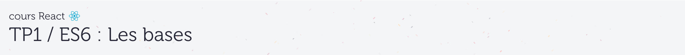
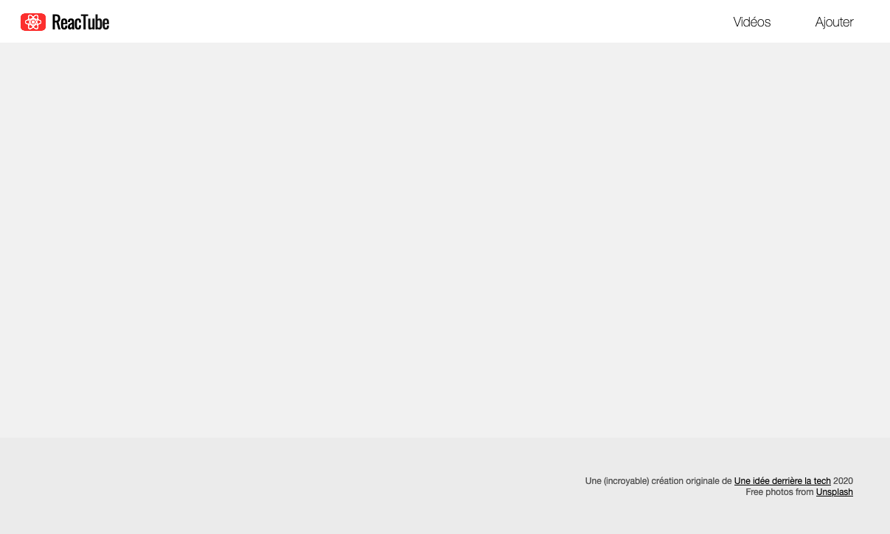

# A. Préparatifs <!-- omit in toc -->

## Sommaire <!-- omit in toc -->
- [A.1. Configuration du projet](#a1-configuration-du-projet)
- [A.2. Ouvrir le projet dans VSCodium](#a2-ouvrir-le-projet-dans-vscodium)
- [A.3. Lancement serveur HTTP](#a3-lancement-serveur-http)

## A.1. Configuration du projet
1. **Si ce n'est pas déjà fait, installez les logiciels suivants :**
	- Git : https://git-scm.com/
	- Node.js (*version **current***): https://nodejs.org/en/download/current/
	- VSCodium : https://vscodium.com/

2. **Ouvrez un terminal** *(si vous êtes sous windows, utilisez **Git bash** installé automatiquement avec Git)*

3. **Récupérez les fichiers de ce TP grâce à Git : clonez ce repo dans un dossier de votre choix** (*ici je clone dans mon dossier utilisateur/tps/js/tp1, attention au sens des slashs selon votre OS*) :
	```bash
	mkdir ~/tps-react
	git clone https://framagit.org/cours-react/tp1.git ~/tps-react/tp1
	```

## A.2. Ouvrir le projet dans VSCodium
**Commencez par ouvrir les fichiers du TP dans VSCodium :**
- soit en le lançant depuis un terminal (*adaptez le chemin vers le projet*):
	```bash
	codium ~/tps-react/tp1
	```
- soit en ouvrant VSCodium, et en glissant le dossier du TP (*celui dans lequel vous avez cloné*) depuis l'explorateur de fichier/finder vers la fenêtre de VSCodium
- soit en ouvrant VSCodium, et en ouvrant le dossier du projet avec <kbd>CTRL</kbd>+<kbd>O</kbd> ou via le menu `File` > `Open`


## A.3. Lancement serveur HTTP

**Pour consulter notre appli web dans un navigateur, il nous faut un serveur http.** <br>On pourrait, pour cet exercice, utiliser n'importe quel serveur http (apache, tomcat, etc.) mais je vous propose d'utiliser Node.js (installé au point A.1.) et 2 utilitaires fournis avec Node : [npm (Node Package Manager)](https://fr.wikipedia.org/wiki/Npm) et [npx](https://www.npmjs.com/package/npx).

1. **Tout d'abord, ouvrez un terminal directement dans VSCodium** en tapant <kbd>CTRL</kbd>+<kbd>J</kbd> (PC) / <kbd>CMD</kbd>+<kbd>J</kbd> (Mac) (ou <kbd>CTRL</kbd>+<kbd>SHIFT</kbd>+<kbd>P</kbd> puis `View: toggle panel`).

	Utiliser le terminal intégré à VSCodium a plusieurs avantages :
	- pas besoin de jongler entre plusieurs fenêtres pour passer de l'IDE au terminal
	- le terminal s'ouvre directement dans le dossier du projet

2. **Dans ce terminal intégré, lancez un serveur http dans le dossier du TP** :
	```bash
	npx serve -l 8000
	```

	Node télécharge alors le paquet "serve" puis le lance dans le dossier tp1. Node se met ensuite en attente de connexions http et affiche quelque chose comme ceci :

	

3. **Vérifiez dans votre navigateur que la page index.html** (fournie dans ce repo) **s'affiche correctement** en ouvrant l'url http://localhost:8000. Le résultat attendu est le suivant : <br><a href="images/readme/screen-00.png"></a>

	*Si la page ne s'affiche pas correctement, vérifiez que vous avez bien lancé votre serveur Node avec npx dans le bon dossier (c'est à dire celui où se trouve le fichier `index.html`).*

## Étape suivante <!-- omit in toc -->
Si tout fonctionne, vous pouvez passer à l'étape suivante : [B. Intégration du JS](B-integration.md)