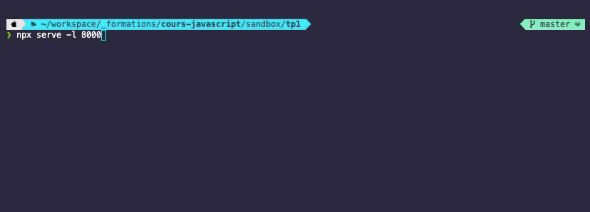

# A. Préparatifs <!-- omit in toc -->

## Sommaire <!-- omit in toc -->
- [A.1. Configuration du projet](#a1-configuration-du-projet)
- [A.2. Lancement serveur HTTP](#a2-lancement-serveur-http)

## A.1. Configuration du projet
1. **Si ce n'est pas déjà fait, installez les logiciels suivants :**
	- Git : https://git-scm.com/
	- Node.js (*version **current***): https://nodejs.org/en/download/current/
	- VSCodium : https://vscodium.com/

2. **Ouvrez un terminal** *(si vous êtes sous windows, utilisez **Git bash** installé automatiquement avec Git)*

3. **Récupérez les fichiers de ce TP grâce à Git : clonez ce repo dans un dossier de votre choix** (*ici je clone dans mon dossier utilisateur/tps/js/tp1, attention au sens des slashs selon votre OS*) :
	```bash
	mkdir ~/tps-react
	git clone https://framagit.org/cours-react/tp1.git ~/tps-react/tp1
	```

## A.2. Lancement serveur HTTP

1. **Lancez un serveur http dans le dossier du TP**.

	Pour consulter notre appli web dans un navigateur, il nous faut un serveur http. On pourrait, pour cet exercice, utiliser n'importe quel serveur http (apache, tomcat, etc.) mais je vous propose d'utiliser Node.js (installé au point A.1.) et 2 utilitaires fournis avec Node : [npm (Node Package Manager)](https://fr.wikipedia.org/wiki/Npm) et [npx](https://www.npmjs.com/package/npx).

	**Lancez un serveur http avec npx** :

	```bash
	cd ~/tps-react/tp1
	npx serve -l 8000
	```

	Node télécharge alors le paquet "serve" puis le lance dans le dossier tp1. Node se met alors en attente de connexions http et affiche quelque chose comme ceci :

	


2. **Vérifiez dans votre navigateur que la page index.html** (fournie dans ce repo) **s'affiche correctement** en ouvrant l'url http://localhost:8000. Le résultat attendu est le suivant : <br><a href="images/readme/screen-00.jpg"></a>

	*Si la page ne s'affiche pas correctement, vérifiez que vous avez bien lancé votre serveur Node avec npx dans le bon dossier (c'est à dire celui où se trouve le fichier `index.html`).*

## Étape suivante <!-- omit in toc -->
Si tout fonctionne, vous pouvez passer à l'étape suivante : [B. Intégration du JS](B-integration.md)