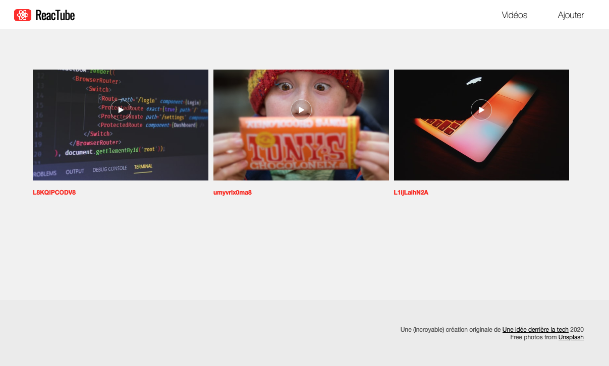
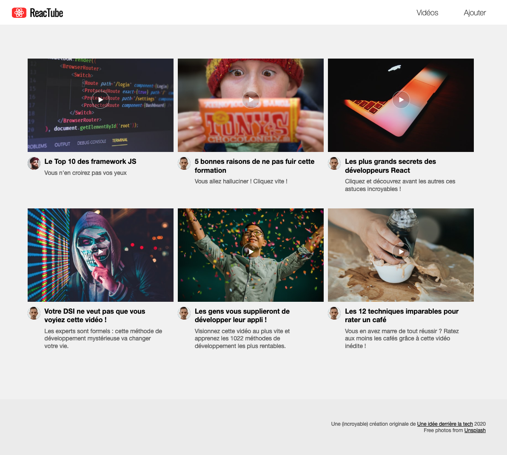

# E. Les tableaux et les objets <!-- omit in toc -->

## Sommaire <!-- omit in toc -->
- [E.1. Manipulation des tableaux](#e1-manipulation-des-tableaux)
- [E.2. Les objets](#e2-les-objets)

## E.1. Manipulation des tableaux

Dans une constante nommée `data`, initialisez un tableau avec 3 cellules contenant les chaines de caractères suivantes : `'L8KQIPCODV8'`, `'umyvrlx0ma8'` et `'L1ijLaihN2A'`.
```js
const data = ['L8KQIPCODV8', 'umyvrlx0ma8', 'L1ijLaihN2A'];
```

Parcourez ce tableau afin de générer 3 liens sur le modèle de celui réalisé à l'étape [D. les chaînes de caractères](./D-chaines.md) :

```html
<a href="https://source.unsplash.com/L8KQIPCODV8/600x340">
	
	<h4>L8KQIPCODV8</h4>
</a>
<a href="https://source.unsplash.com/umyvrlx0ma8/600x340">
	
	<h4>umyvrlx0ma8</h4>
</a>
<a href="https://source.unsplash.com/L1ijLaihN2A/600x340">
	
	<h4>L1ijLaihN2A</h4>
</a>
```

Selon votre degré de maîtrise de JS, vous pouvez utiliser une des différentes méthodes de parcours des tableaux :
1. Une boucle `for` classique (https://developer.mozilla.org/fr/docs/Web/JavaScript/Reference/Instructions/for)
2. La méthode `Array.forEach` (https://developer.mozilla.org/fr/docs/Web/JavaScript/Reference/Objets_globaux/Array/forEach)
3. la méthode `Array.map` (https://developer.mozilla.org/fr/docs/Web/JavaScript/Reference/Objets_globaux/Array/map) accompagnée de la méthode `Array.join` (https://developer.mozilla.org/fr/docs/Web/JavaScript/Reference/Objets_globaux/Array/join)
4. ou enfin pour les plus motivés, la méthode `Array.reduce` (https://developer.mozilla.org/fr/docs/Web/JavaScript/Reference/Objets_globaux/Array/reduce)

*NB: pour `forEach`, `map` et surtout `reduce` pensez à utiliser les arrow functions !*

Le résultat obtenu sera identique dans les 4 cas :

<a href="images/readme/screen-03.png"></a>

## E.2. Les objets
Modifiez le tableau `data` : au lieu de 3 chaînes de caractères, on va maintenant y mettre des objets littéraux :

```js
const data = [
	{
		id: 1,
		title:'Le Top 10 des framework JS',
		description:'Vous n\'en croirez pas vos yeux',
		file: 'video1.mp4',
		thumbnail: 'L8KQIPCODV8'
	},
	{
		id: 2,
		title:'5 bonnes raisons de ne pas fuir cette formation',
		description:'Vous allez halluciner ! Cliquez vite !',
		file: 'video2.mp4',
		thumbnail: 'umyvrlx0ma8'
	},
	{
		id: 3,
		title:'Les plus grands secrets des développeurs React',
		description:'Cliquez et découvrez avant les autres ces astuces incroyables !',
		file: 'video3.mp4',
		thumbnail: 'L1ijLaihN2A'
	},
	{
		id: 4,
		title:'Votre DSI ne veut pas que vous voyiez cette vidéo !',
		description:'Les experts sont formels : cette méthode de développement mystérieuse va changer votre vie.',
		file: 'video1.mp4',
		thumbnail: 'XIVDN9cxOVc'
	},
	{
		id: 5,
		title:'Les gens vous supplieront de développer leur appli !',
		description:'Visionnez cette vidéo au plus vite et apprenez les 1022 méthodes de développement les plus rentables.',
		file: 'video2.mp4',
		thumbnail: 'E9ANYNkN4Sc'
	},
	{
		id: 6,
		title:'Les 12 techniques imparables pour rater un café',
		description:'Vous en avez marre de tout réussir ? Ratez aux moins les cafés grâce à cette vidéo inédite !',
		file: 'video3.mp4',
		thumbnail: 'uwIJbtLpvV4'
	}
];
```

Modifiez la boucle pour générer un code de ce type :
```html
<a href="https://source.unsplash.com/L8KQIPCODV8/600x340">
	
	<section class="infos">
		<h4>Le Top 10 des framework JS</h4>
		<p>Vous n'en croirez pas vos yeux</p>
	</section>
</a>
```

Le rendu final devra correspondre à ceci :

<a href="images/readme/screen-04.png"></a>

## Étape suivante <!-- omit in toc -->
Si tout fonctionne, vous pouvez passer à l'étape suivante : [F. Compiler avec Babel](./F-babel.md)